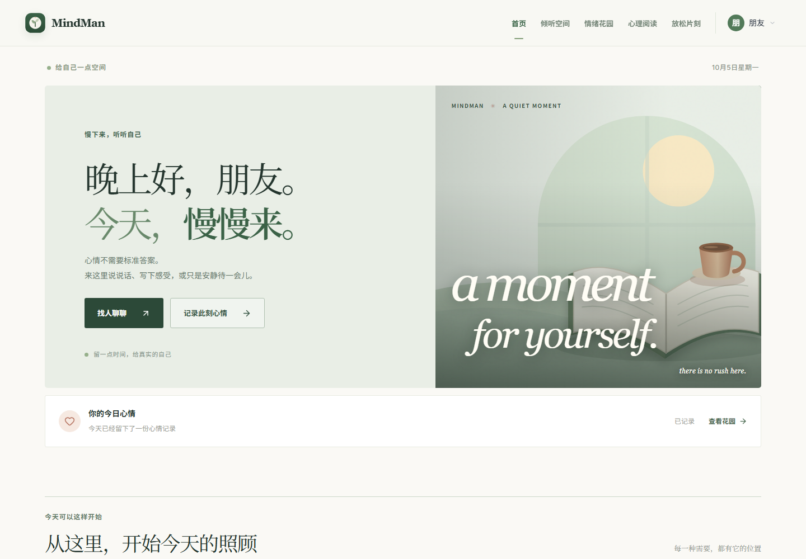
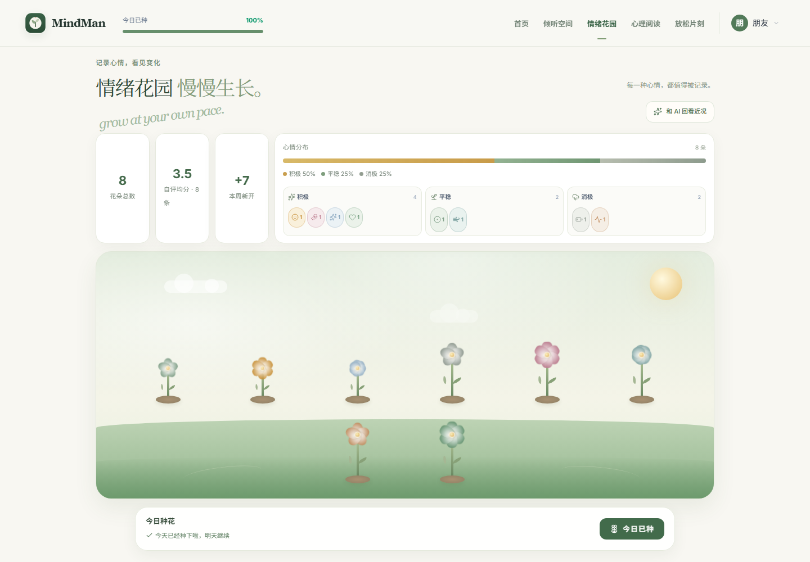
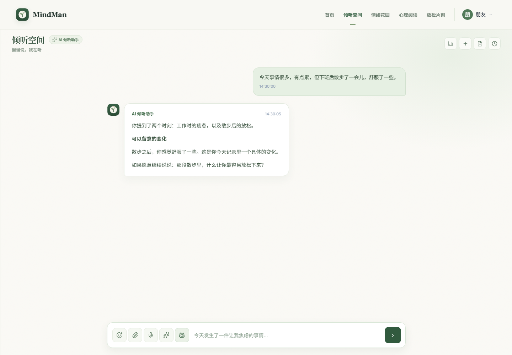
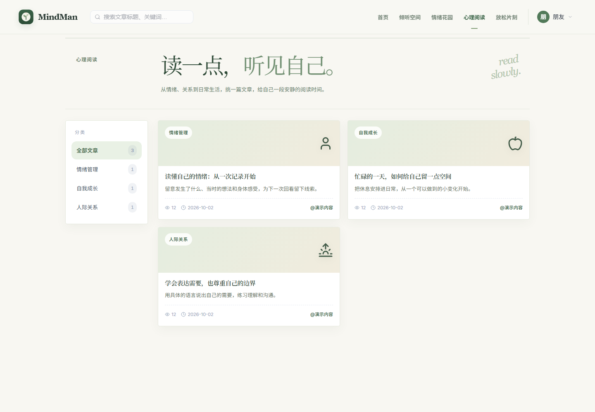
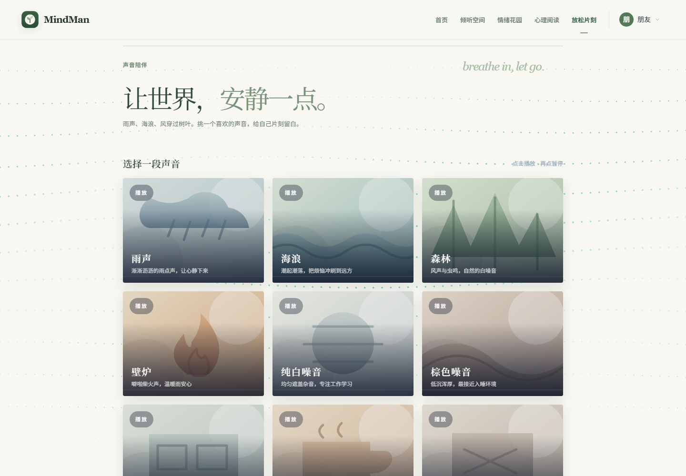
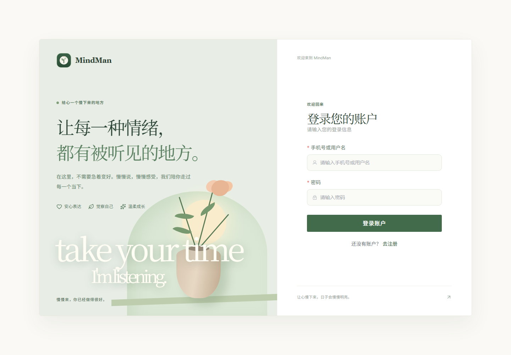

# MindMan

**慢慢说，慢慢记录，慢慢了解自己。**

一个把 AI 倾听、情绪分析、心情记录和心理阅读连接起来的日常陪伴空间。

[在线预览](https://mindman-preview.onrender.com/) · [用户指南](./docs/user-guide.md) · [页面预览](#页面预览) · [版本更新](./docs/releases/v1.1.0.md) · [安装与部署](./docs/developer-guide.md) · [English](./README_EN.md)

## 给自己一点空间

有时想说说今天发生的事，有时只想记下一句话。MindMan 提供五个可以随时进入的空间：

| 空间 | 你可以做什么 |
| --- | --- |
| **首页** | 查看近期记录、心情变化和阅读入口，从此刻需要的事情开始。 |
| **倾听空间** | 与 AI 对话，梳理具体的感受；回看、归档会话，并生成本次对话总结。 |
| **情绪花园** | 写下当天的心情和情境，让每一次记录成为一朵花；查看分布，回看或编辑记录。 |
| **心理阅读** | 按分类和关键词找文章，查看来源；带着文章进入对话，请 AI 提炼要点或翻译英文内容。 |
| **放松片刻** | 选择环境声音或噪声，播放一段适合自己的背景声。 |

## AI 怎样帮你

### 从你的话里寻找线索

倾听空间会根据当前分享整理情绪线索，并展示分析依据。你可以继续补充信息，或指出分析与实际感受不一致的地方。

### 把记录连接起来

主动选择回顾情绪花园后，AI 可以参考近 30 天、最多 14 条记录，整理出现较多的心情、已有评分和可能的情境联系。

在种花或编辑记录时，也可以请 AI 回看这段文字，获得具体观察、一个继续思考的问题，以及有文字依据的参考评分。情绪、睡眠和压力的证据不足时，对应评分可以为空。

**AI 评分是根据文字作出的参考估计。** 你自己的评分与 AI 参考分应分别理解；它们不代表临床测量结果。

### 让阅读继续成为对话

从文章页进入倾听空间时，会自动带上文章标题和当前收录内容。你可以提炼要点、翻译英文，或结合自己的情况继续聊。

外部文章可能只收录订阅源摘要。翻译和分析以站内实际收录的内容为范围，完整上下文请通过“查看原文”阅读。

## 页面预览

以下截图来自当前前端，账号、文章和对话采用演示数据，仅用于展示界面，不代表真实用户记录或模型效果评测。

### 情绪花园

把一天的感受留在花园里，也给以后的自己留一点线索。

### 倾听空间

从一句话开始，分段回看回复，也可以保存和整理这段对话。

### 心理阅读与放松片刻

| 心理阅读 | 放松片刻 |
| --- | --- |
|  |  |

查看登录页面

## 第一次使用

1. 打开部署好的网站，注册并登录自己的账号。
2. 到 **情绪花园** 写下今天的心情；愿意时，再请 AI 回看。
3. 到 **倾听空间** 说说具体发生的事，或选择回顾已有记录。
4. 找到喜欢的文章后，选择 **带去倾听空间**，继续阅读与讨论。
5. 想休息时，进入 **放松片刻** 选择一段声音。

更详细的操作说明见 [用户指南](./docs/user-guide.md)。[在线预览](https://mindman-preview.onrender.com/) 可使用已填入的 `demo / 123456` 演示账号进入。预览仅展示页面与模拟交互，未连接真实 AI 或云端数据库；完整功能需要自行部署。

## 运行与可用性

MindMan 支持调用云端模型或 Ollama 本地模型。AI 对话、分析、参考评分和总结需要一个可连接的模型服务。

如果模型运行在个人电脑上，而网站与后端部署在云端，还需要配置两端的安全网络连接。电脑关机、休眠或模型服务停止时，依赖该模型的 AI 功能暂不可用；网站与已保存的数据仍由云端服务提供。

部署前请阅读 [开发与部署说明](./docs/developer-guide.md) 和 [阿里云部署手册](./deploy/部署手册.md)。混合部署需要额外配置网络和模型地址，并非默认开箱即用。

购买服务器前，可以使用 [Render 免费预览配置](./deploy/render-preview.md) 展示前端。该模式会明确标注演示状态，不连接真实 AI 或云端数据库。

## 关于你的记录

- 登录后的记录和对话按账号管理；归档会话可以恢复。
- 管理后台具备查询用户、情绪记录和会话的能力。自建服务的管理者应限制后台访问，并说明数据处理方式。
- 对话中尽量避免填写密码、身份证号等不必要的敏感信息。使用云端模型时，提交给模型的内容会发送到对应服务商。

MindMan 用于日常记录和自我觉察。AI 输出可能有误，不提供医学诊断，也不能替代专业心理服务。

## 项目与反馈

前端使用 Vue 3，后端使用 Java / Spring Boot；另有可选 Python 情绪记录 Agent。模型可接入云端 OpenAI 兼容接口或本地 Ollama。

- [开发、接口与部署说明](./docs/developer-guide.md)
- [Python Agent 说明](./code/python-agent/README.md)
- [测试工具说明](./tests/README.md)
- [反馈问题或提出建议](https://github.com/OwenWhw/MindMan-MentalHealth-Assistant/issues)

提交问题时，可以附上复现步骤和已遮盖个人信息的截图。

[MIT License](./LICENSE) · 旧版界面源码保存在 `design-archive/`，当前页面以 `code/ai-vue/` 为准。
